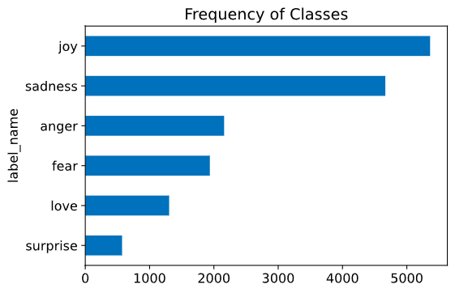
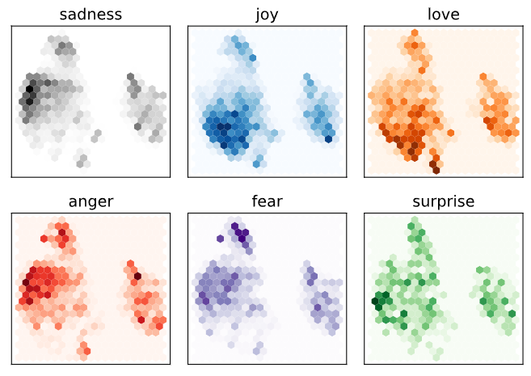
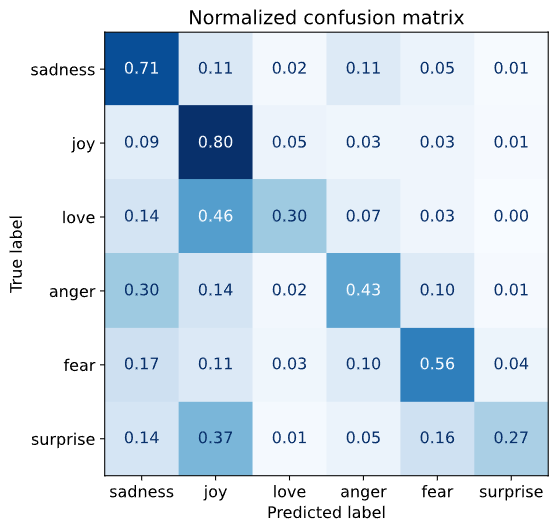
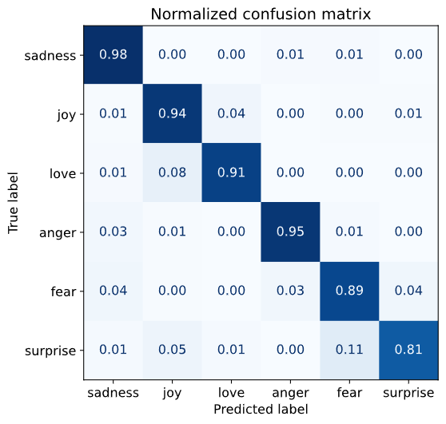

# トークン化とテキスト分類
あいうえお

---
# 目次
- トークン化
- データセット
- Tokenizer
- テキスト分類

---
<!-- header: "トークン化" -->
# トークン化

---
# トークン化とは
- Transformerが理解できるようにテキストをある「粒度」で固有の数値に分解すること
  - この「粒度」がトークンにあたる
- 例：WordPiece（distilbert-base-uncasedモデル付属のTokenizer）
  - テキスト：This is a pen.
<pre class="mermaid">
graph TB;
    T[テキスト] --> 101
    T --> 2023
    T --> 2003
    T --> 1037
    T --> 7279
    T --> 1012
    T --> 102
</pre>

---
# トークン化の種類
- 文字トークン化
- 単語トークン化
- サブワードトークン化

---
<!-- header: "トークン化：トークン化の種類" -->
# 文字トークン化
- すべての文字に固有の番号を割り当てて、文章を文字単位でone-shotベクトル化する
- 例：
  - 数値の割り当て: {' ': 0, '.': 1, 'T': 2, 'a': 3, 'e': 4, 'h': 5, 'i': 6, 'n': 7, 'p': 8, 's': 9}
  - ベクトル(This is a pen.)
    - [[0, 0, 1, 0, 0, 0, 0, 0, 0, 0], [0, 0, 0, 0, 0, 1, 0, 0, 0, 0],
        [0, 0, 0, 0, 0, 0, 1, 0, 0, 0], [0, 0, 0, 0, 0, 0, 0, 0, 0, 1],
        [1, 0, 0, 0, 0, 0, 0, 0, 0, 0], [0, 0, 0, 0, 0, 0, 1, 0, 0, 0],
        [0, 0, 0, 0, 0, 0, 0, 0, 0, 1], [1, 0, 0, 0, 0, 0, 0, 0, 0, 0],
        [0, 0, 0, 1, 0, 0, 0, 0, 0, 0], [1, 0, 0, 0, 0, 0, 0, 0, 0, 0],
        [0, 0, 0, 0, 0, 0, 0, 0, 1, 0], [0, 0, 0, 0, 1, 0, 0, 0, 0, 0],
        [0, 0, 0, 0, 0, 0, 0, 1, 0, 0], [0, 1, 0, 0, 0, 0, 0, 0, 0, 0]]

---
<!-- header: "Tips：one-hotベクトル" -->
# one-hotベクトル
- あるベクトルの要素について、一つだけ`1`でそれ以外は`0`のベクトル
  - トークン（ベクトル）が`1`になっている要素のラベルと対応
- 例：
  - トークン: T
  - トークン固有の数値: 2
  - One-hotベクトル: [0, 0, 1, 0, 0, 0, 0, 0, 0, 0]

---
# さっきの例をテーブルで書くと……
||` `(0)|.(1)|T(2)|a(3)|e(4)|h(5)|i(6)|n(7)|p(8)|s(9)|
|-|-|-|-|-|-|-|-|-|-|-|
|T|0|0|1|0|0|0|0|0|0|0|
|h|0|0|0|0|0|1|0|0|0|0|
|i|0|0|0|0|0|0|1|0|0|0|
|s|0|0|0|0|0|0|0|0|0|1|
|` `|1|0|0|0|0|0|0|0|0|0|
|i|0|0|0|0|0|0|1|0|0|0|
|s|0|0|0|0|0|0|0|0|0|1|

---
||` `(0)|.(1)|T(2)|a(3)|e(4)|h(5)|i(6)|n(7)|p(8)|s(9)|
|-|-|-|-|-|-|-|-|-|-|-|
|` `|1|0|0|0|0|0|0|0|0|0|
|a|0|0|0|1|0|0|0|0|0|0|
|` `|1|0|0|0|0|0|0|0|0|0|
|p|0|0|0|0|0|0|0|0|1|0|
|e|0|0|0|0|1|0|0|0|0|0|
|n|0|0|0|0|0|0|0|1|0|0|
|.|0|1|0|0|0|0|0|0|0|0|

---
# one-hotベクトルの利点・欠点
- 利点
  - トークンに対応する値そのものの順序の影響をなくせる
    - 例えば、` `と`.`は0と1であるので、Transformerが` `の次は`.`になると学習してしまうのを防げる
- 欠点
  - 一つのベクトルの要素数がすべてのトークン数になってしまう
    - 日本語の文字トークン化だと単純に考えて（アルファベットの個数）＋（数字の数）＋（記号の数）＋（ひらがなの個数）＋（カタカナの個数）＋（漢字の数）個の要素のベクトルができてしまう

---
<!-- header: "トークン化：トークン化の種類" -->
# 文字トークン化の利点・欠点
- 利点
  - スペルミスや珍しい単語の処理ができる
- 欠点
  - 単語構造から学習させる必要がある
    - 膨大なデータ・計算資源が必要

ということで現在はそれほど使われていない

---
# 単語トークン化
- すべての単語に固有の番号を割り当てて、文章を単語単位でone-shotベクトル化する
- 例：This is a pen.
  - 数値の割り当て
    - {"This": 0, "is": 1, "a": 2, "pen.": 3}
  - ベクトル(This is a pen.)
    - [[1, 0, 0, 0],
       [0, 1, 0, 0],
       [0, 0, 1, 0],
       [0, 0, 0, 1],]

---
# 単語トークン化の欠点
- 語尾変化等によって単語の種類が膨大であるためベクトルが大きくなりモデルが巨大化する
  - 100万次元->1000次元にニューラルネットワークで圧縮するとなると10億の重みが必要
- 番号が割り振られてない単語（Tokenizerが認識してない単語）をベクトル化できない
  - 一応`UNK`というトークンにすることでベクトル化できるが意味が消えてしまう

---
# サブワードトークン化
- 頻出単語はそのままにして、稀な単語は分割して文字・単語トークン化をする
  - 文字トークン化と単語トークン化のいいとこどり
- 例
  - テキスト：Tokenizing text is a core task of NLP.
<pre class="mermaid">
flowchart TB;
    T[テキスト] --> T1["[CLS]"]
    T --> T2[token]
    T --> T3["##izing"]
    T --> T4[text]
    T --> is
    T --> a
    T --> core
    T --> task
    T --> of
    T --> nl
    T --> T5["##p"]
    T --> T6["."]
    T --> T7["[SEP]"]
</pre>

---
<!-- header: "データセット" -->
# データセット

---
# 今回用いるデータセット
- X(旧Twiiter)の英語のポストについて6つの感情で分類したもの
- 感情は以下の6つ
  - anger
  - love
  - fear
  - joy
  - sadness
  - surprise

---
# データセットの構造
- 内訳
  - 学習用データ：16000件
  - 検証用データ：2000件
  - お試し用データ：2000件
- 内容
  - text: ポスト内容
  - label: textから読み取れる感情

---
# データの不均衡

- joyが一番多い
  - 学習用データのうち5362件
- 今回は話を簡単にするためにデータ数をそろえずに行う


---
<!-- header: "Tokenizer" -->
# Tokenizer

---
<!-- header: "Tokenizer：Tokenizerの役割" -->
# Tokenizerの役割
- トークン化＆ベクトルの復号
- 学習データの正規化
  - padding
  - 切り詰め

今回はWordPieceを具体例にしています

---
<pre class="mermaid">
sequenceDiagram
    actor T AS User
    participant TO AS Tokenizer
    participant TR AS Encorder/Decorder
    T ->> TO: テキスト
    TO ->> TR: 数値ベクトル
    Note right of TO: padding, 切り詰め
    TR ->> TO: 生成された数値ベクトル
    TO ->> T: 生成されたテキスト
</pre>

---
<!-- header: "Tokenizer：特殊なトークン" -->
# 特殊なトークン①
- \[PAD\]
  - トークンID：0
  - 学習テキスト間のトークン数が合わないときに帳尻を合わせる用のトークン
- \[UNK\]
  - トークンID：100
  - トークン化できなかった単語を示すトークン
- \[CLS\]
  - トークンID：101
  - テキストの開始を示すトークン
---
# 特殊なトークン②
- \[SEP\]
  - トークンID：102
  - テキストの終了を示すトークン
- \[MASK\]
  - トークンID：103
  - このトークンにあたるテキスト部分がマスクされていることを示すトークン
- \#\#〇〇
  - 前のトークンと一続きであることを示す

---
<!-- header: "Tokenizer：コード" -->
# トークン化するコード
```python
from transformers import AutoTokenizer

model_ckpt = "distilbert-base-uncased"
# tokenizerの取得
tokenizer = AutoTokenizer.from_pretrained(model_ckpt)

# トークン化
encoded_text = tokenizer("Tokenizing text is a core task of NLP.")
print(encoded_text)
# 出力
# {'input_ids': [101, 19204, 6026, 3793, 2003, 1037, 4563, 4708, 1997, 17953,
# 2361, 1012, 102], 'attention_mask': [1, 1, 1, 1, 1, 1, 1, 1, 1, 1, 1, 1, 1]}
```

---
# ベクトルを復号化するコード
```python
# ベクトルをトークンに戻す
tokens = tokenizer.convert_ids_to_tokens(encoded_text.input_ids)
print(tokens)
# 出力
# ['[CLS]', 'token', '##izing', 'text', 'is', 'a', 'core', 'task', 'of', 'nl',
# '##p', '.', '[SEP]']

# トークンをテキストに戻す
print(tokenizer.convert_tokens_to_string(tokens))
# 出力
# [CLS] tokenizing text is a core task of nlp. [SEP]
```

---
<!-- header: "Tokenizer：学習データの正規化" -->
# 学習データの正規化
- padding
  - 学習テキスト間のトークン数が合わないときに帳尻を合わせる
  - たいてい最長のトークン数に合わせるようにこのトークンが追加される
- 切り詰め
  - モデルの最大コンテキストサイズに合わせてトークンを捨てる

---
<!-- header: "Tokenizer：アテンションマスク" -->
# アテンションマスク
- 学習するテキスト間のトークン数が異なるときpaddingする
  - モデルが元のトークンと追加された`[PAD]`トークンとで混乱しないようにしたい
- アテンションマスク
  - トークン部分を`1`、`[PAD]`部分を`0`にしたベクトルの集合
  - これでモデルに`[PAD]`トークンの位置を教える

---


---
<!-- header: "Tokenizer：コード" -->
# 実際に学習データをトークン化してみる
```python
def tokenize(batch):
    # padding・切り詰めありでトークン化
    return tokenizer(batch["text"], padding=True, truncation=True)

# もともとのデータセットに含まれるもの
print(emotions_encoded["train"].column_names)
# 出力：['text', 'label']

# データ全部をトークン化する
emotions_encoded = emotions.map(tokenize, batched=True, batch_size=None)
```

---
# 実際に学習データをトークン化してみる
```python
# トークン化した後のデータセットに含まれるもの
print(emotions_encoded["train"].column_names)
# 出力：['text', 'label', 'input_ids', 'attention_mask']

# 学習用データの最初の二つを出力してみる
print(emotions_encoded["train"][:2])
# 出力
# {'input_ids': [[101, 1045, 2134, 2102, 2514, 26608, 102, 0, 0, 0, 0, 0, 0, 0, 0,
# 0, 0, 0, 0, 0, 0, 0, 0], [101, 1045, 2064, 2175, 2013, 3110, 2061, 20625, 2000,
# 2061, 9636, 17772, 2074, 2013, 2108, 2105, 2619, 2040, 14977, 1998, 2003, 8300,
# 102]], 'attention_mask': [[1, 1, 1, 1, 1, 1, 1, 0, 0, 0, 0, 0, 0, 0, 0, 0, 0, 0,
# 0, 0, 0, 0, 0], [1, 1, 1, 1, 1, 1, 1, 1, 1, 1, 1, 1, 1, 1, 1, 1, 1, 1, 1, 1, 1,
# 1, 1]]}
```

---
<!-- header: テキスト分類 -->
# テキスト分類

---
<!-- header: テキスト分類：テキスト分類器 -->
# テキスト分類器
- 構成
  - Transfomer エンコーダー
    - 入力トークンを解釈する部分
    - 今回はDistilBERT
  - 分類ヘッド
    - エンコーダーから出力される隠れ状態から実際に分類する部分

---
# アーキテクチャー図


---
<!-- header: テキスト分類：テキスト分類器の学習 -->
# テキスト分類器の学習方
- 特徴抽出
  - 隠し状態から特徴を抽出するように分類ベッドのみ学習
    - 事前学習済みモデル（エンコーダー部分）の更新なし
- ファインチューニング
  - モデル全体（エンコーダ・分類ヘッダ）を再学習する

---
<!-- header: テキスト分類：テキスト分類器の学習（特徴抽出） -->
# 特徴抽出の特徴
- 小さいor浅いモデルが使える
  - 勾配に依存しない手法が使える
  - GPUなしで現実的に計算できる

---
# 隠れ状態の取得
1. テキストに対してトークン化を行いトークンIDのベクトルとアテンションマスクを得る
2. エンコーダーにベクトルとアテンションマスクを渡す
3. 出力のうち`[CLS]`トークンに関する隠れ状態を得る
4. 1.～3.をすべてのテキストに対して行う

---
# アーキテクチャー図（再掲）


---
<!-- header: テキスト分類：コード -->
# 実際に取得してみる
```python
from transformers import AutoModel

# モデルの読み込み
model_ckpt = "distilbert-base-uncased"
device = torch.device("cuda" if torch.cuda.is_available() else "cpu")
model = AutoModel.from_pretrained(model_ckpt).to(device)

def extract_hidden_states(batch):
    # モデルの入力（ベクトル・アテンションマスク：k）の値(v)をGPUに読み込む
    inputs = {k:v.to(device) for k,v in batch.items() 
              if k in tokenizer.model_input_names}
    # 計算を減らすために勾配を計算しない
    with torch.no_grad():
        # モデルの出力を得る
        last_hidden_state = model(**inputs).last_hidden_state
    # [CLS] トークンの隠れ状態をcpu側に読み込んで返す
    return {"hidden_state": last_hidden_state[:,0].cpu().numpy()}
```

---
# 実際に取得してみる
```python
# トークン化されたデータセットに対して、ベクトル・アテンションマスク・ラベル（分類結果）
# を"PyTorch"形式で出力するように変更
emotions_encoded.set_format("torch", 
                            columns=["input_ids", "attention_mask", "label"])

# データセット全体に対してextract_hidden_statesを作用させて隠れ状態を得る
emotions_hidden = emotions_encoded.map(extract_hidden_states, batched=True)

# 実際に学習データに対して隠れ層が取得できたかを確かめる
print(emotions_hidden["train"].column_names)
# 出力
# ['text', 'label', 'input_ids', 'attention_mask', 'hidden_state']
```

---
<!-- header: テキスト分類：テキスト分類器の学習（特徴抽出） -->
# 隠れ状態の可視化
- 756次元の隠れ状態を2次元に落として可視化してみる
  - UMAP(Uniform Manifold Approximation and Projection)アルゴリズムを用いる
    - 各点の関係性をなるべく保持したまま次元を削減できる
    - UMAPをうまく働かせるには値を[0, 1]で正規化するとよいらしい
    - 具体的な内容はわかりません

---
# 可視化した結果

- sadness/anger/fearが似ている
- joy/loveが似てる
- suppriseは全体的に広がっている

---
# 分類ヘッダの学習
- 今回はロジスティック回帰モデルで学習
  - 正答率：0.633
    - ベースライン（すべて"joy"と判定する）場合は0.352
- **特徴抽出は簡易的な学習だがベースラインより十分性能が出ている**

---
# 特徴抽出でのモデル性能
- 分類器の混同行列から推定できる
  - 真のラベルのデータ件数に対して、モデルが予測したラベルのデータ件数の比率
    - 逆も同様
  - 例
    - 真のラベル：sadness
    - 予測ラベル
      - sandenn: 0.71
      - joy: 0.09
      - love: 0.13 ……

---
# 特徴抽出でのモデル性能

- 予測ラベルと真のラベル
  - sadness
    - よくanger, fearが混じる
  - joy
    - よくlove, surpriseが混じる
- これらは隠れ層の可視化でみた特徴が表れている

---
<!-- header: テキスト分類：テキスト分類器の学習（ファインチューニング） -->
# ファインチューニングの特徴
- 事前学習モデルの最適化ができる
  - もしモデルが分類タスクにあまりできしていなくても何とかなる
- 分類ヘッドが微分可能でないとだめ
  - ニューラルネットワークを用いる

---
# ファインチューニングの方法
1. 事前モデルを読み込み、分類ヘッダ（ニューラルネットワーク）とつなげる
2. 性能を評価する関数を作成する
   - 今回はF1スコアと正答率を用いる
3. 学習させる

---
<!-- header: テキスト分類：コード -->
# 実際にファインチューニングをやってみる
```python
from transformers import AutoModelForSequenceClassification

# 分類ヘッダの出力
num_labels = 6
# 分類ヘッダ付きでモデルを読み込む
model = (AutoModelForSequenceClassification
         .from_pretrained(model_ckpt, num_labels=num_labels)
         .to(device))

from sklearn.metrics import accuracy_score, f1_score

# 評価関数
def compute_metrics(pred):
    labels = pred.label_ids
    preds = pred.predictions.argmax(-1)
    f1 = f1_score(labels, preds, average="weighted")
    acc = accuracy_score(labels, preds)
    return {"accuracy": acc, "f1": f1}
```

---
# 実際にファインチューニングをやってみる
```python
from transformers import Trainer, TrainingArguments

# 一回当たりの学習に使うデータ数
batch_size = 64 
#全データ学習に必要な学習回数
logging_steps = len(emotions_encoded["train"]) // batch_size 
model_name = f"{model_ckpt}-finetuned-emotion"
training_args = TrainingArguments(output_dir=model_name,
                                  num_train_epochs=2, # 全データでの学習回数
                                  learning_rate=2e-5,
                                  per_device_train_batch_size=batch_size,
                                  per_device_eval_batch_size=batch_size,
                                  weight_decay=0.01,
                                  evaluation_strategy="epoch",
                                  disable_tqdm=False,
                                  logging_steps=logging_steps,
                                  push_to_hub=False, 
                                  log_level="error")
```

---
# 実際にファインチューニングをやってみる
```python
trainer = Trainer(model=model, args=training_args, 
                  compute_metrics=compute_metrics,
                  train_dataset=emotions_encoded["train"], # 学習用データ
                  eval_dataset=emotions_encoded["validation"], # 検証用データ
                  tokenizer=tokenizer)
trainer.train()
```

---
<!-- header: テキスト分類：テキスト分類器の学習（ファインチューニング） -->
# ファインチューニングの結果
- 正答率: 0.939
  - 特徴抽出の場合は0.633
  - ベースライン（すべて"joy"と判定する）場合は0.352
- **ファインチューニングするとさらに性能が向上**

---
# ファインチューニングでのモデル性能

- 予測ラベルと真のラベルの関係
  - ほとんど正確に識別している
  - joy
    - love, supriseが混じっている
  - suprize
    - fearが混じっている


<script type="module">
import mermaid from 'https://cdn.jsdelivr.net/npm/mermaid@11.4.1/dist/mermaid.esm.min.mjs';
mermaid.initialize({ startOnLoad: true });
window.addEventListener('vscode.markdown.updateContent', function() { mermaid.init() });
</script>